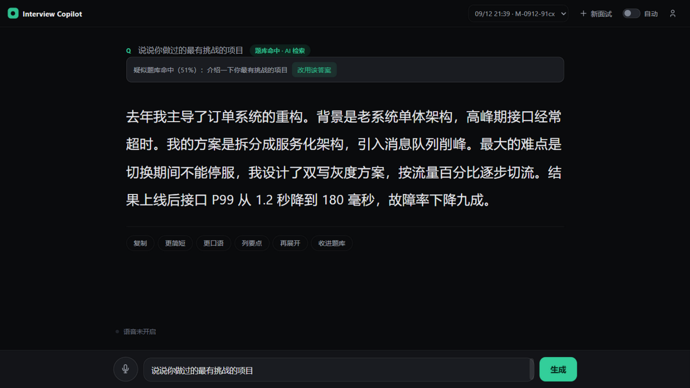

# Interview Copilot

面试实时提词助手。面试官的问题进来，你准备过的答案或 AI 生成的回答以大字提词器呈现——原样照着念就行。

单文件服务 + 单页面，无 Docker、无数据库、无构建步骤，Python 3.10+ 即可运行。



## 功能

**输入**

- 电脑麦克风听音：浏览器原生语音识别（Chrome/Edge 免费内置），自动转写面试官的问题
- 手机推送：手机浏览器打开同页面（局域网），输入问题一键推送到电脑
- 手动输入：直接打字，Enter 生成

**回答**

- 自动模式：开启后听完问题停顿 2 秒自动生成，念完答案说「下一题」或按空格继续，全程不用碰鼠标
- 题库双通道检索：
  - 本地词面匹配（毫秒级）：归一化 + 字符 n-gram + 关键词加权，命中的准备稿交给 AI 微调
  - AI 语义检索：题库整体进入模型上下文，换种问法也能对上
  - 命中的答案由 AI 结合岗位 JD 和具体问法微调后输出——保留你的事实与数据，不照搬原文
- 未命中走 AI 正常生成；回答后一键「收进题库」，题库越用越准
- 会话管理：每场面试独立 ID，全量上下文传给模型，追问接得住

**准备**

- 面试定制：在抽屉「速览」里粘贴目标公司的业务、岗位要求、人才画像，AI 回答会向这些方向靠拢（存本地，不进仓库）
- 简历导入：PDF / Word / TXT 自动解析填充「我的背景」，AI 回答基于你的真实经历
- 题库导入：Markdown 自动解析（标题分块 / Q&A 前缀 / 分隔线 / 加粗 / 编号列表，支持混排），识别不动的杂乱笔记可切换 AI 兜底解析
- 回答后一键「收进题库」，题库越用越准

**快捷键**（设置 → 快捷键，点击后按下想要的键即可绑定，支持 Ctrl/Alt/Shift 组合键）

| 动作 | 默认按键 |
|------|---------|
| 开始 / 停止录音 | `F2` |
| 生成回答 | `Enter` |
| 恢复聆听（下一题） | `Space` |
| 复制答案 / 收进题库 / 重新生成 | 默认未绑定，可自行设置 |

## 快速开始

```bash
# 方式一：uv（推荐）
uv venv .venv
uv pip install -r requirements.txt --python .venv
.venv/Scripts/python server.py

# 方式二：pip
python -m venv .venv
.venv/Scripts/pip install -r requirements.txt
.venv/Scripts/python server.py
```

Windows 下直接双击 `启动.bat`。

- 本机访问：http://localhost:8787
- 手机访问：http://<局域网IP>:8787（与电脑同一 Wi-Fi，防火墙放行 8787 端口）

## AI 配置

右上角抽屉「AI 设置」，支持任意 OpenAI 兼容接口：

| 字段 | 示例 |
|------|------|
| Base URL | `https://ark.cn-beijing.volces.com/api/coding/v3`（火山方舟 Coding Plan）或 `https://api.deepseek.com` |
| API Key | 对应服务商的密钥 |
| 模型 | `deepseek-v4-flash` / `doubao-seed-2.0-lite` / `gpt-4o` 等 |

- 思考挡位：`none`/`minimal` 关闭思考（实时面试推荐），`low`~`max` 控制推理深度；目标服务不支持的参数会自动降级
- 温度、最大输出 Token 可调
- 所有请求经本地后端代理转发，规避浏览器 CORS 限制；上游报错原样展示

## 架构

```
browser (index.html)
  ├─ 本地词面匹配 ──── 命中 → 秒出题库答案
  ├─ AI 生成请求 ──┐
  └─ 手机推送轮询 ──┤
                   ▼
server.py (FastAPI, :8787)
  ├─ /api/ai/chat    → 转发到任意 OpenAI 兼容接口（SSE 流式）
  ├─ /api/ai/resume  → PDF/DOCX/TXT 解析
  ├─ /api/relay      → 手机→电脑问题中转（内存）
  └─ /api/bank       → 题库 CRUD（bank.json）
```

无数据库。会话与配置存浏览器 localStorage，题库存服务端 bank.json——如需持久化扩展，SQLite 足矣。

## 隐私

- 所有数据（会话、题库、简历、配置）只存在你自己的电脑和浏览器里
- md 内容仅在导入解析、回答生成时发送给你自己配置的 AI 服务，本工具不经过任何第三方

## FAQ

**手机打不开页面？** 确认与电脑同一 Wi-Fi；Windows 防火墙需放行 8787 端口（`netsh advfirewall firewall add rule name="InterviewCopilot-8787" dir=in action=allow protocol=TCP localport=8787`，需管理员）。

**扫描版（图片型）PDF 解析不出文字？** 本工具不含 OCR，请手动复制粘贴简历内容。

**语音识别没反应？** 仅 Chrome / Edge 支持 Web Speech API，且 `localhost` 或 HTTPS 下才可用；首次需允许麦克风权限。

**AI 回答前卡几秒？** 推理模型（如 deepseek-v4-flash）会先思考；实时场景换 `doubao-seed-2.0-lite` 这类非思考模型，或把思考挡位调到 `none`。

## License

MIT
